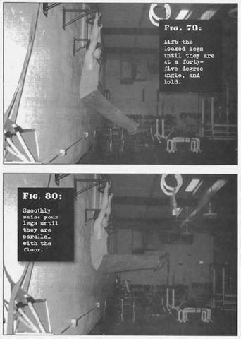

# Partial Straight Leg Raises

## Performance

- Hang from an overhead bar, with your body in a straight line and your feet off the floor. Tighten the shoulders. Lift the locked legs until they are at a forty-five degree angle, and hold. This is the start position.
- Keeping your knees locked straight, smoothly raise your legs until they are parallel with the floor. This is the finish position.
- Pause for a moment, before lowering the legs back to a forty-five degree angle. Repeat.
- Exhale as your legs move up, inhale as they move down. Keep the abs tight.

## Goals

| | |
|---|---|
|Beginner: | 1x5 |
|Intermediate: | 2x10 |
|Progression: | 2x15 |

## Figures

