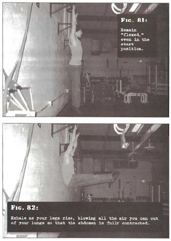

# Hanging Straight Leg Raises

## Performance

- You know the drill by now! Take hold of an overhead bar which is high enough to leave your feet a short distance from the floor when your body is extended. Your hands should be approximately shoulder width apart. Ensure that the shoulders are tight. This is the start position.
- Smoothly--over the course of at least two seconds--raise your legs until they are parallel with the floor. Exhale as your legs rise, blowing all the air you can out of your lungs so that the abdomen is fully contracted. This is the finish position.
- Pause, before reversing the motion perfectly for at least another two seconds until you are back in the start position. Inhale as you go.
- Remain "flexed," even in the start position. Your legs must stay locked at all times and you must use pure muscular control; no momentum allowed.

## Goals

| | |
|---|---|
|Beginner: | 1x5 |
|Intermediate: | 2x10 |
|Progression: | 2x30 |

## Figures

