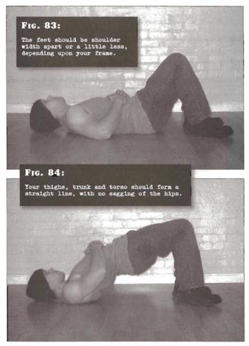

# Short Bridges

## Performance

- Lie on your back, with your legs stretched out and your hands crossed on your stomach. Draw your feet in, bending the knees until your shins are nearly parallel to the ground and your feet are flat on the floor. The feet should be shoulder width apart or a little less, depending upon your frame. Your heels will be around six to eight inches from your buttocks.
- Press down through the feet, lifting the hips and back clear of the ground until only the shoulders and feet are supporting the bodyweight. At this point, your thighs, trunk and torso should form a straight line, with no sagging of the hips.
- Pause in the top position for a moment, before reversing the motion, lowering your body back to the start position.
- Repeat the exercise for your target repetitions, exhaling as you go up, inhaling on the way down.

## Goals

| | |
|---|---|
|Beginner: | 1x10 |
|Intermediate: | 2x20 |
|Progression: | 3x40 |

## Figures

