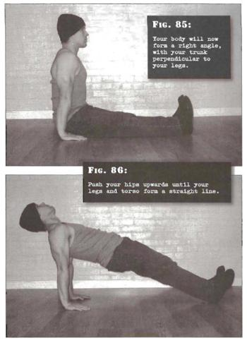

# Straight Bridges

## Performance

- Sit on the ground with your legs stretched out in front of you. Your knees should be straight, with your feet about shoulder width apart. Place your palms on the floor on either side of your hips, with your fingers pointing towards your toes. Sit up straight. Your body will now form a right angle, with your trunk perpendicular to your legs. This is the start position.
- Press down through the hands, tensing the arms as you simultaneously push your hips upwards until your legs and torso form a straight line. Draw the chin up and look towards the ceiling. At this point your bodyweight will be passing through your palms and heels. This is the finish position.
- Pause before reversing the motion and repeating as necessary. Exhale as you press your-self up, inhale as you go down.

## Goals

| | |
|---|---|
|Beginner: | 1x10 |
|Intermediate: | 2x20 |
|Progression: | 3x40 |

## Figures

