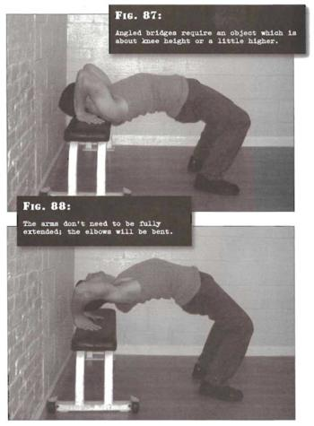

# Angled Bridges

## Performance

- Angled bridges require an object which is about knee height or a little higher. Sit on the edge of the bunk or bed, and lie back with your feet flat on the ground. They should be approximately shoulder width apart. Shuffle forwards a little so that your hips are off the bunk, and place your hands either side of your head, with your fingers pointing towards your feet. This is the start position (fig. 1)
- Press down through the hands, straightening the elbows and pushing the hips up, arching your back as you do so.
- Continue smoothly pushing as far as you can, at least until your head and body are entirely clear of the bunk. The arms don't need to be fully extended; the elbows will be bent. You may only lift up a few inches. That's fine. Allow your head to tilt back under control, so that you can see the wall behind you. This is the finish position (fig 2).
- Reverse the motion, lowering yourself until your torso and head are resting completely on the bunk again. Repeat as necessary, breathing normally.

## Goals

| | |
|---|---|
|Beginner: | 1x8 |
|Intermediate: | 2x15 |
|Progression: | 3x30 |

## Figures

