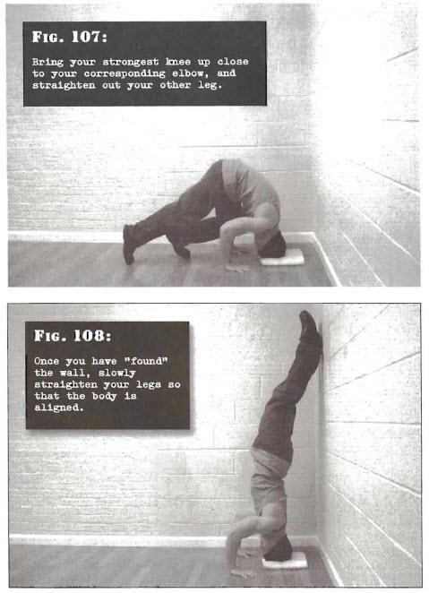

# Wall Headstands

## Performance

- Find a solid wall. Place a pillow, cushion or folded towel down by the base of the wall. This will be for your head.
- Get on your hands and knees, and place the top of your head on the cushion. Your skull should be between six and ten inches from the wall. Set your palms down securely on either side of your head, about shoulder width apart. Bring your strongest knee up close to your corresponding elbow, and straighten out your other leg so the knee is off the ground.
- Now, push down hard with your strongest leg, as you simultaneously kick your other leg up in the air so that both legs dynamically move up towards the wall. Once you have "found" the wall, slowly straighten your legs so that the body is aligned.
- Keep the mouth closed and breath smoothly though the nose. After you have remained up for the required time, bend the legs and bring them down under control.

## Goals

| | |
|---|---|
|Beginner: | 30 seconds |
|Intermediate: | 1 minute |
|Progression: | 2 minutes |

## Figures

