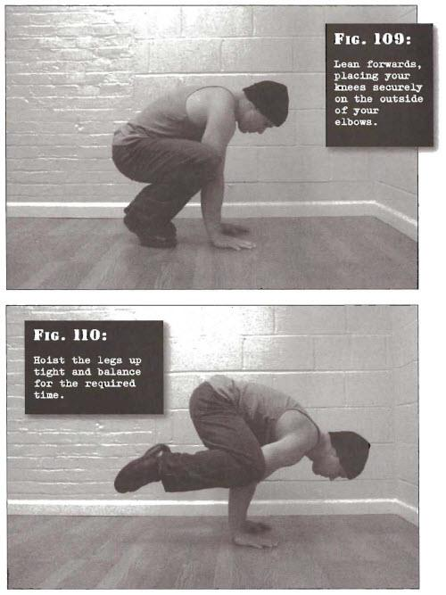

# Crow Headstands

## Performance

- Sit down on your haunches with your knees apart. Place your palms on the floor in front of you, at approximately shoulder width distance apart. Your arms should be bent a little. Lean forwards, placing your knees securely on the outside of your elbows
- Now gradually con-tinue tipping yourself forward, placing more and more weight through your palms and correspondingly less through your feet. Eventually the point of balance will shift, and your feet will lose contact with the ground. Hoist the legs up tight and balance for the required time, breathing steadily
- When you are finished, reverse the movement by gently tipping your weight backwards until your toes come into contact with the floor again

## Goals

| | |
|---|---|
|Beginner: | 10 seconds |
|Intermediate: | 30 seconds |
|Progression: | 1 minute |

## Figures

