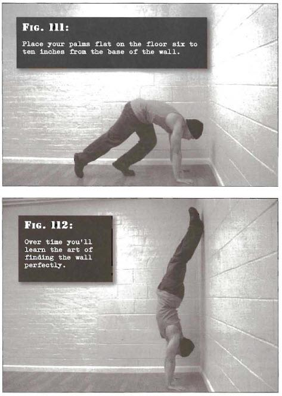

# Wall Handstands

## Performance

- Approach a solid wall. Place your palms flat on the floor six to ten inches from the base of the wall, at about shoulder width apart. Your arms should be straight, or nearly so.
- Bend at the knees, bracing the whole body. Bring the knee of your strongest leg up towards the corresponding elbow (fig. 1) and push down hard with that leg, kicking back and up with the other leg. As you rise, anow the foot of your strongest leg to leave the floor and follow your other leg as it approaches the wall. Keep your arms extended. The heels of both your feet should touch the wall at the same time.
- At first your back and butt may also slam into the wall as you overestimate the power required to kick up, but over time you'll learn the art of finding the wall perfectly. At this point your arms should be straight and your body aligned with a slight arch towards the wall. This is the position for the wall handstand technique (fig. 2).
- Hold this position for the required time, breathing normally.

## Goals

| | |
|---|---|
|Beginner: | 30 seconds |
|Intermediate: | 1 minute |
|Progression: | 2 minutes |

## Figures

