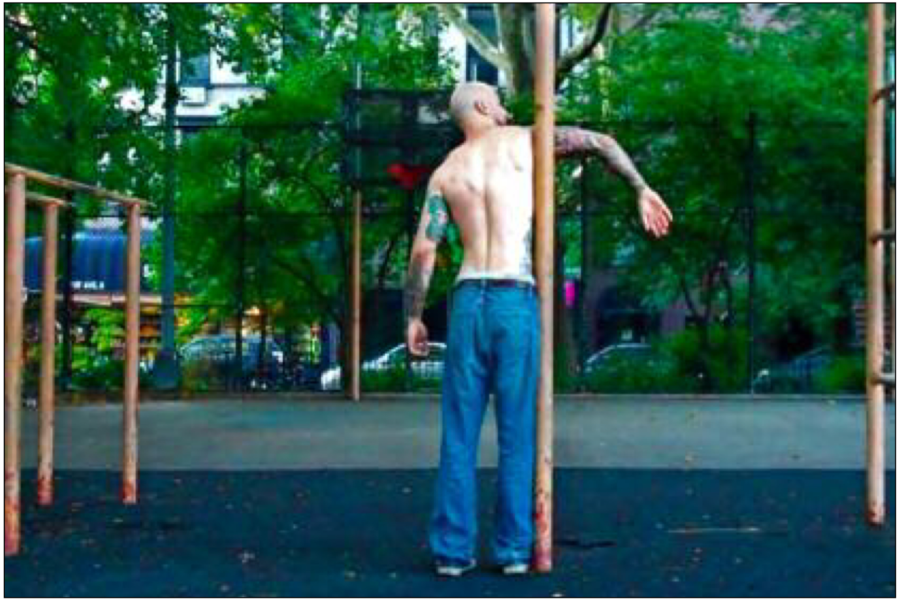
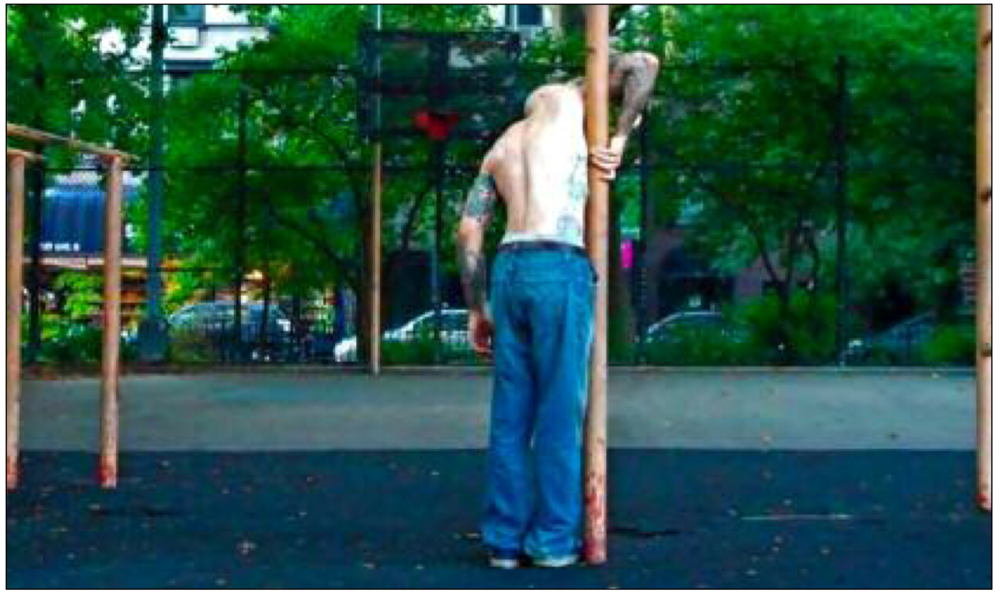
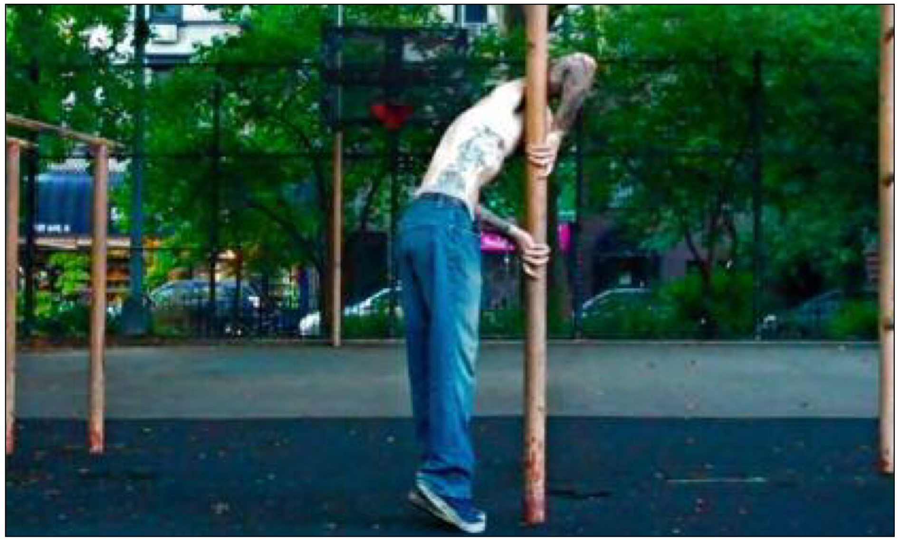
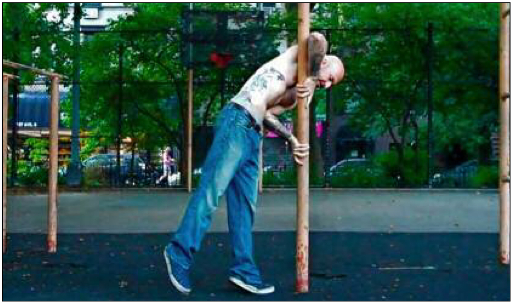
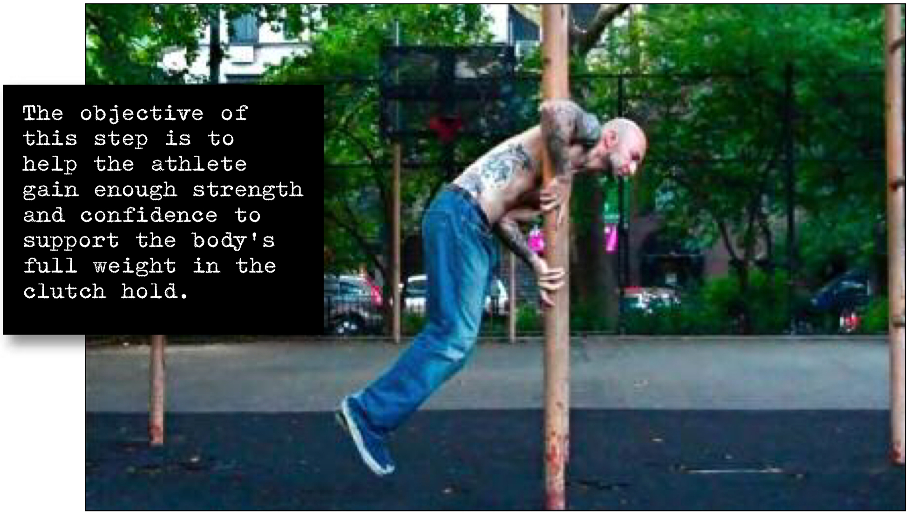

# Clutch Hang

## Performance

### The basic clutch hold

- Approach your vertical base (whether a column, pole, post, beam or whatever). With your right arm extended, place your armpit/upper lat firmly into the base. This will help give you your initial positioning.

- Curl your right arm back and round the base, bending the elbow and placing your hand firmly on the base. Your index finger should point down, but the other fingers can hug the base if it’s the right shape for that. However your place your fingers, the palm-heel should be solidly against the base.

- Place your left hand against the base. It should be at approximately hip level, with the elbow bent. Push really hard against the base, with as much tension as you can generate. This will be the hand that stops you falling later on, so it has to be tight.

- Position yourself back slightly by taking a mini-step back and/or bending at the waist. This is to give you space to position your left elbow firmly into your waist, a little above the left hip. At this point, your left forearm should be close to diagonal. Now brace everything for take-off!

- There you go—this is the basic clutch hold you’ll need for all the following steps. (For a clutch hold on the opposite side, just substitute “left” for “right” and so on.) Over time you’ll find that these four separate motions become one fluid movement. As you progress, you’ll also find your hold technique varies slightly from what I’ve laid out. That’s fine—diff’rent strokes, baby.

### Clutch Hang

- Approach your vertical base, and begin to get into the basic clutch hold.
- Hug the base strongly, pushing in as hard as you can with your hands, and using the elbow in your waist like a lever.
- Once you feel you’ve generated enough tension, slowly lift your feet off the floor—one at a time at first. Don’t try to lift your legs out to the side just yet. Relax your lower body, and let your legs hang straight down, with your knees bent.
- Lift your feet off the ground by bending your knees and lifting your feet slightly behind you, rather than by raising your knees up at the hips. This first step is meant to be an upper body exercise, not an abdominal exercise.

## Goals

| | |
|---|---|
|Progression: | 10 seconds |

## Figures

