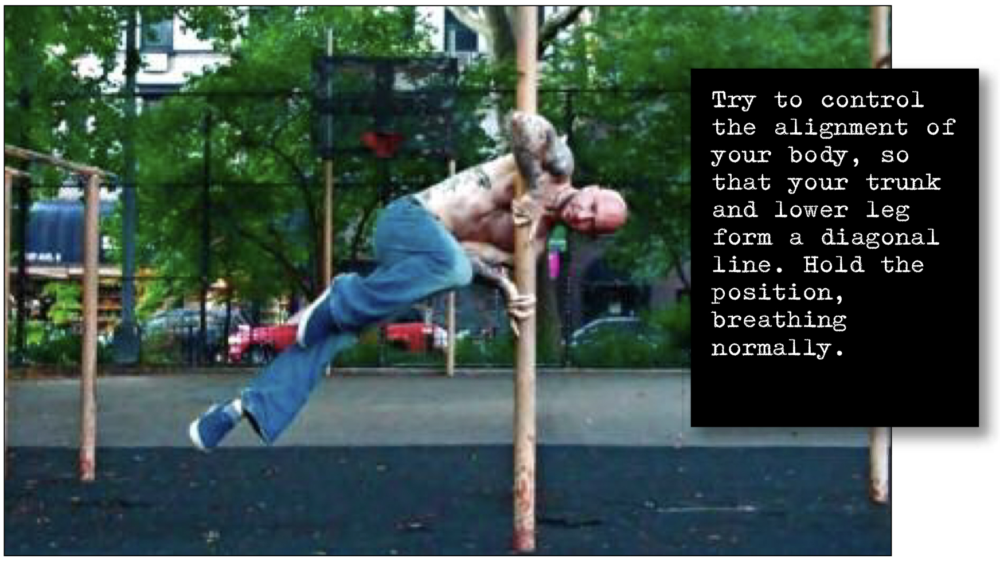

# Diagonal Split Clutch

## Performance

- Approach your vertical base, and get into the basic clutch hold
- Your elbow should be securely positioned in your waist above the hip. This elbow position will push your hips off-center and out to the side a little. From here, hop out to the side as you bend the knee of your right leg and draw it up as high as possible. Simultaneously, straighten out your lower leg. Try to control the alignment of your body, so that your trunk and lower leg form a diagonal line.
- Hold the position, breathing normally.

## Goals

| | |
|---|---|
|Progression: | 10 seconds |

## Figures

