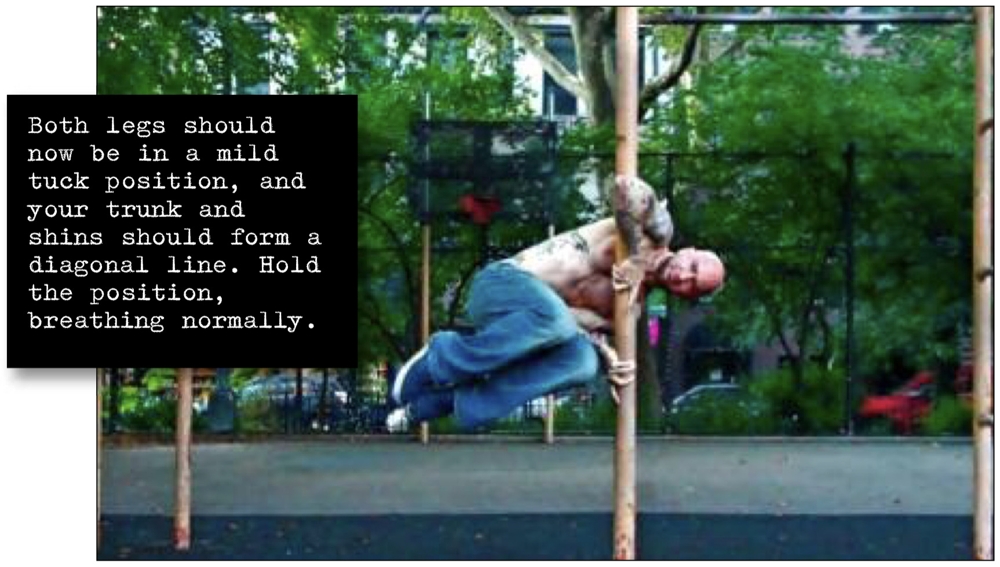

# Diagonal Tuck Clutch

## Performance

- Approach your vertical base, and get into the basic clutch hold. From here, get into a diagonal split clutch.
- Once your right leg is tucked as close to your trunk as possible, draw up your left leg so that it's next to your upper leg. Both legs should now be in a mild tuck position, and your trunk and shins should form a diagonal line.
- Hold the position, breathing normally.

## Goals

| | |
|---|---|
|Progression: | 10 seconds |

## Figures

