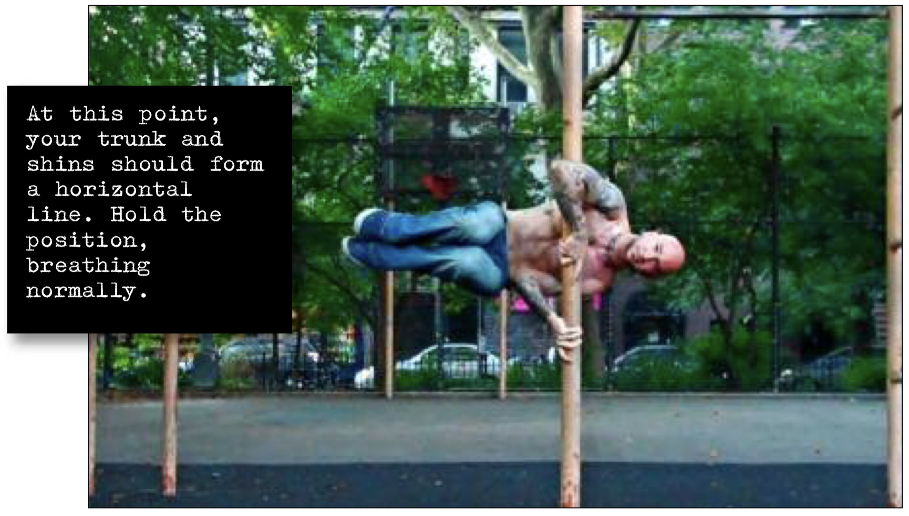

# Horizontal Tuck Clutch

## Performance

- Approach your vertical base, and get into the basic clutch hold.
- Brace yourself and hop up onto your lower forearm, simultaneously  bringing your knees up opposite your hips (the tuck position). At this point, your trunk and shins should form a horizontal line.
- Hold the position, breathing normally.

## Goals

| | |
|---|---|
|Progression: | 10 seconds |

## Figures

