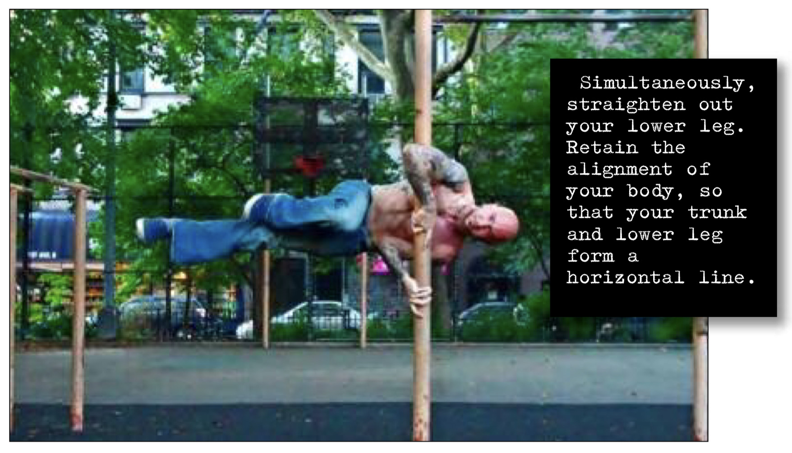

# Horizontal Split Clutch

## Performance

- Approach your vertical base, and get into the basic clutch hold.
- Initiate the hold by getting into a horizontal tuck clutch (step 5).
- Keep the knee of your upper leg bent and opposite your hips. Simultaneously, straighten out your lower leg. Retain the alignment of your body, so that your trunk and lower leg form a horizontal line.
- Hold the position, breathing normally.

## Goals

| | |
|---|---|
|Progression: | 10 seconds |

## Figures

