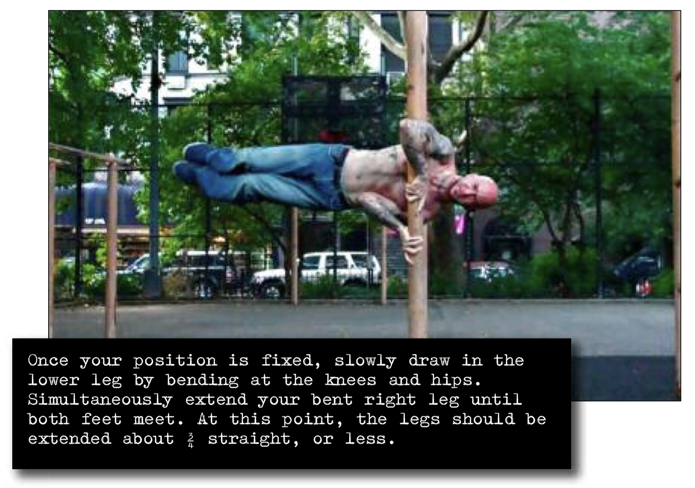

# Bent Leg Clutch Flag

## Performance

- Approach your vertical base, and get into the basic clutch hold.
- From here, get into a horizontal split clutch (step 6).
- Once your position is fixed, slowly draw in the lower leg by bending at the knees and hips. Simultaneously extend your bent right leg until both feet meet. At this point, the legs should be extended about ¾ straight, or less. Although the joints bend, the body line (trunk and legs) should remain completely horizontal.
- Hold the position, breathing normally.

## Goals

| | |
|---|---|
|Progression: | 10 seconds |

## Figures

