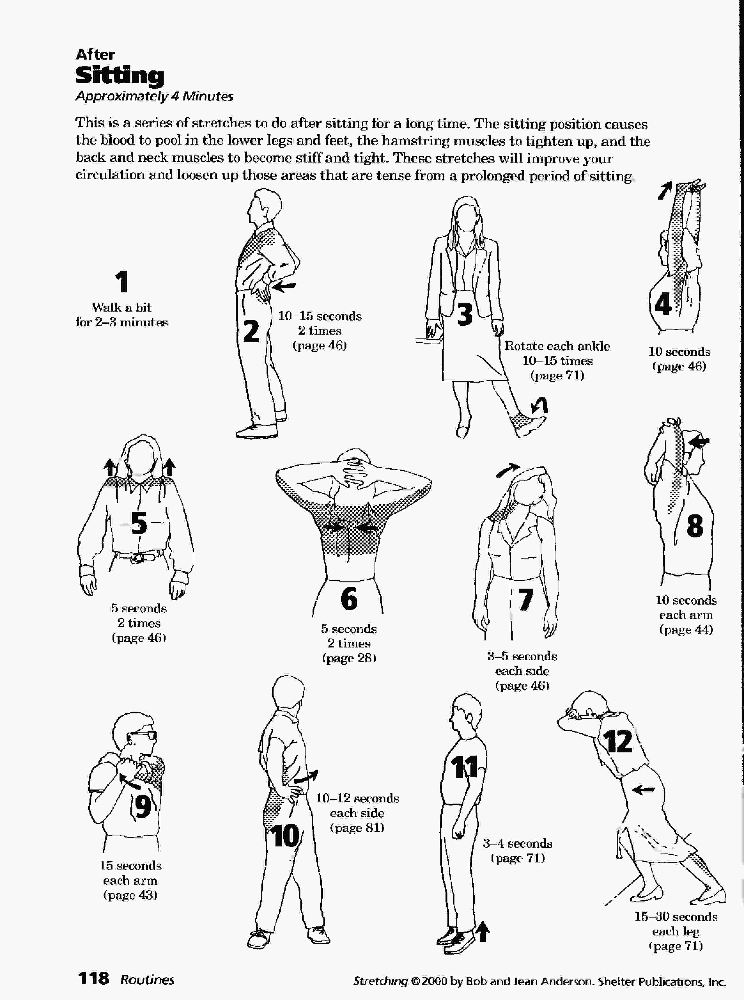

## Routine After_Sitting

### Details

1. Walk a bit for 2-3 minutes
1. details in [here](details/lower_back_chest_p46.md)
1. details in [here](details/ankle_rotate_p71.md)
1. details in [here](details/arms_up_p46.md)
1. details in [here](details/shoulder_shrug_p46.md)
1. details in [here](details/shoulder_blade_pinch_p28.md)
1. details in [here](details/neck_shoulder_p46.md)
1. details in [here](details/shoulder_p44.md)
1. details in [here](details/shoulder_p43.md)
1. details in [here](details/upper_body_rotate_p81.md)
1. details in [here](details/stand_on_toes_p71.md)
1. details in [here](details/legs_p71.md)
